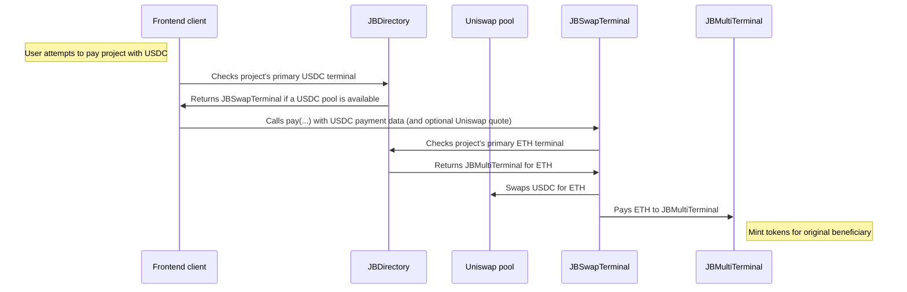

# nana-swap-terminal-v5

A Juicebox terminal that accepts payments in any token, swaps them via Uniswap V3, and forwards the proceeds to another terminal that accepts the output token.

_If you're having trouble understanding this contract, take a look at the [core protocol contracts](https://github.com/Bananapus/nana-core) and the [documentation](https://docs.juicebox.money/) first. If you have questions, reach out on [Discord](https://discord.com/invite/ErQYmth4dS)._

## Architecture

| Contract | Description |
|----------|-------------|
| `JBSwapTerminal` | Core terminal. Accepts any token via `pay` or `addToBalanceOf`, swaps through a Uniswap V3 pool to a configured `TOKEN_OUT`, then forwards the output to the project's primary terminal. Uses TWAP oracle for automatic slippage protection when the caller doesn't provide a quote. |
| `JBSwapTerminalRegistry` | A proxy terminal that delegates `pay` and `addToBalanceOf` to a per-project or default `JBSwapTerminal` instance. Allows project owners to choose (and lock) which swap terminal implementation they use. |

## How It Works

1. A payer calls `pay(projectId, token, amount, ...)` with any token.
2. The terminal accepts the token (supports ERC-20 approvals and Permit2).
3. If `token != TOKEN_OUT`, it swaps via the project's configured Uniswap V3 pool.
4. Slippage protection: the caller can pass a minimum output quote in metadata (`quoteForSwap` key), or the terminal calculates one from the pool's TWAP oracle with dynamic slippage tolerance.
5. The output tokens are forwarded to the project's primary terminal for `TOKEN_OUT` via `terminal.pay(...)` or `terminal.addToBalanceOf(...)`.



## Install

For projects using `npm` to manage dependencies (recommended):

```bash
npm install @bananapus/swap-terminal
```

For projects using `forge` to manage dependencies:

```bash
forge install Bananapus/nana-swap-terminal
```

If you're using `forge`, add `@bananapus/swap-terminal/=lib/nana-swap-terminal/` to `remappings.txt`.

## Develop

`nana-swap-terminal` uses [npm](https://www.npmjs.com/) (version >=20.0.0) for package management and [Foundry](https://github.com/foundry-rs/foundry) for builds and tests.

```bash
npm ci && forge install
```

| Command | Description |
|---------|-------------|
| `forge build` | Compile the contracts and write artifacts to `out`. |
| `forge test` | Run the tests. |
| `forge fmt` | Lint. |
| `forge build --sizes` | Get contract sizes. |
| `forge coverage` | Generate a test coverage report. |
| `forge clean` | Remove the build artifacts and cache directories. |

### Scripts

| Command | Description |
|---------|-------------|
| `npm test` | Run local tests. |
| `npm run test:fork` | Run fork tests (for use in CI). |
| `npm run coverage` | Generate an LCOV test coverage report. |

### Configuration

Key `foundry.toml` settings:

- `solc = '0.8.23'`
- `evm_version = 'paris'` (L2-compatible)
- `optimizer_runs = 100000000`

## Repository Layout

```
nana-swap-terminal-v5/
├── src/
│   ├── JBSwapTerminal.sol          # Core swap terminal
│   ├── JBSwapTerminalRegistry.sol  # Per-project terminal routing
│   └── interfaces/
│       ├── IJBSwapTerminal.sol     # Swap terminal interface
│       ├── IJBSwapTerminalRegistry.sol # Registry interface
│       └── IWETH9.sol              # WETH wrapper interface
├── script/
│   └── Deploy.s.sol                # Deployment script
└── test/
    ├── Fork/                       # Fork tests
    └── helper/                     # Test helpers
```

## Payment Metadata

The `JBSwapTerminal` accepts encoded `metadata` in its `pay(...)` function. Metadata is decoded using `JBMetadataResolver`:

```solidity
(bool exists, bytes memory quote) =
    JBMetadataResolver.getDataFor(JBMetadataResolver.getId("quoteForSwap"), metadata);

if (exists) {
    (minAmountOut) = abi.decode(quote, (uint256));
}
```

If no quote is provided, the terminal calculates one from the pool's TWAP oracle with a dynamic slippage tolerance based on the estimated price impact of the swap.

The terminal also supports Permit2 metadata (key: `"permit2"`) for gasless token approvals.

## Risks

- The terminal never holds a token balance. After every swap, all output tokens are forwarded and leftover input tokens are returned to the payer.
- Pool validation uses `FACTORY.getPool()` rather than create2, so the terminal works on chains where Uniswap V3 factory bytecode may differ.
- TWAP fallback: when no observations exist, the terminal falls back to the pool's current spot tick rather than reverting.
- `addDefaultPool` calls `pool.increaseObservationCardinalityNext(10)` to proactively set up TWAP history. `_getQuote` also reverts if observations are missing as a safety net.
